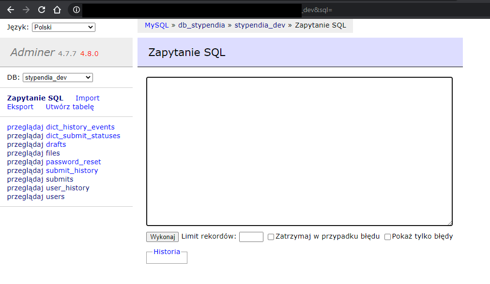

# Adminer

Do zarządzania bazą danych, podglądu i ich raportowania służy nam znany program **Adminer**. Przy jego pomocy administratorzy będą mieli możliwość generowania raportów  ze wszystkich danych dotyczących, użytkowników, wniosków, plików i poszczególnych zdarzeń:

