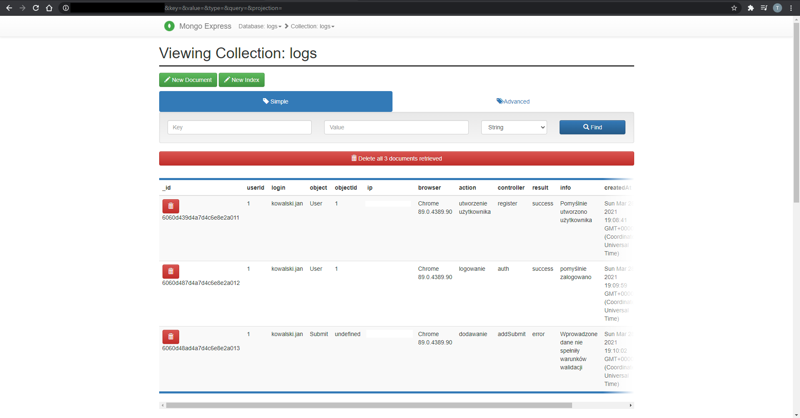

# Mikroserwisy - aplikacje wspierające aplikację główną

Aplikacja główna wspierana jest przez kilka serwisów (innych aplikacji) dodatkowych, spełniających różne  zadania.

# Logowanie aktywności

Jedną z nich jest aplikacja raportująca zebrane dane o aktywności użytkowników (logi). Dzięki niej w łatwy sposób możemy sprawdzi0ć aktywność użytkownika w zadanym czasie w aplikacji głównej, jeżeli będzie to konieczne. Dostęp do danych mają tylko administratorzy:

