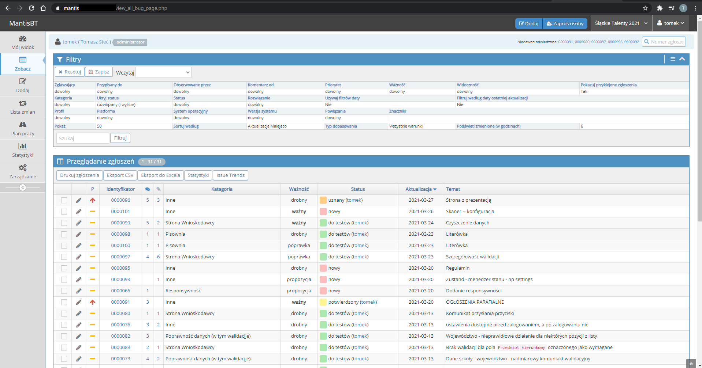
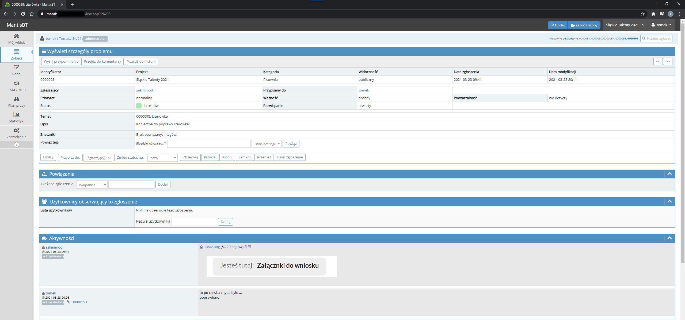

# Mantis Bug Tracker

Aplikacja Mantis Bug Tracker to znana aplikacja służąca do zarządzania zgłoszeniami użytkowników dotyczących błędów oraz do zgłaszania nowych funkcji. Dzięki niej proces poprawy błędów i zgłaszania pomysłów został znacznie usprawniony. Widoczne poniżej zgłoszenia (w tej chwili ponad 100) dotyczą naszej aplikacji:

