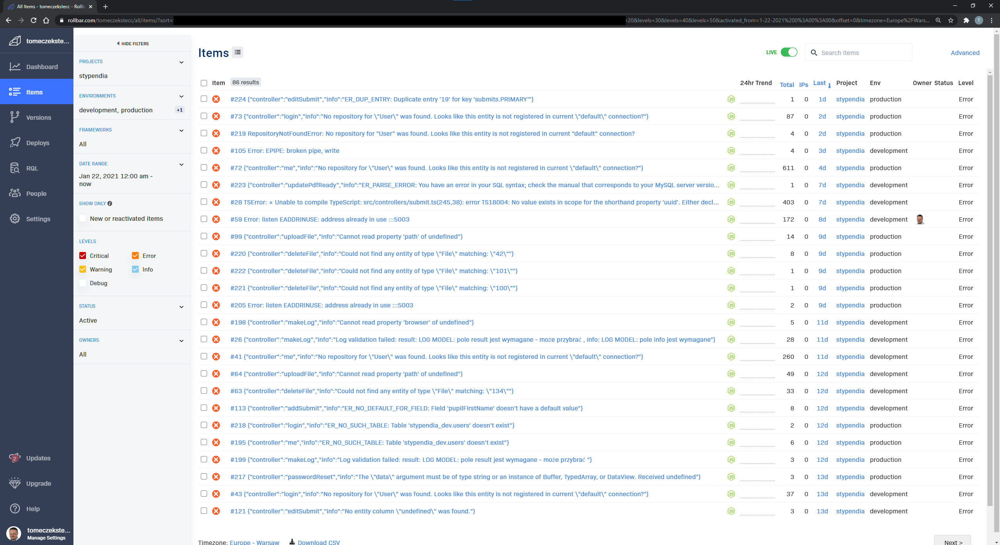

# Rollbar

Rollbar to uznana aplikacja służąca do śledzenia błędów w aplikacji w czasie rzeczywistym. Dzięki wdrożeniu dla naszej aplikacji, w przypadku wystąpienia określonego rodzaju błędu zostaje wysłane automatyczne powiadomienie o:
- rodzaju i treści błędu,
- miejscu w aplikacji, gdzie błąd wystąpił,
- platformy (produkcyjna, testowa),
- liczbie wystąpień,
- zdarzeń poprzedzających błąd.

Dzięki temu można maksymalnie szybko usunąć taki błąd, ograniczając jego skutki do minimum.

