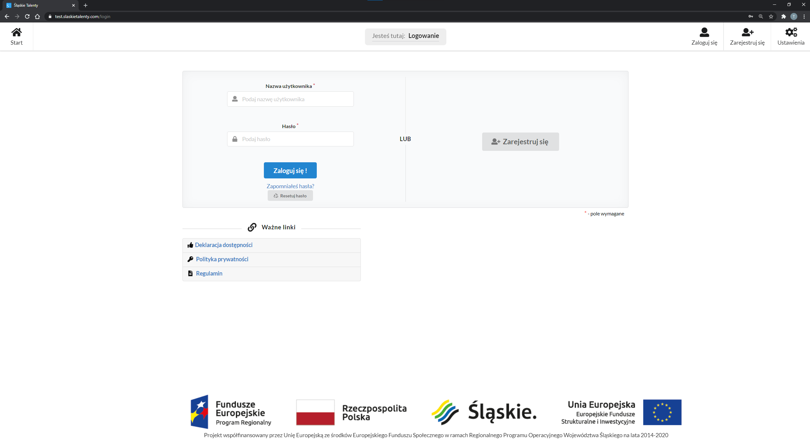

Aplikację trzeba nieustannie testować:
- pod względem wydajności,
- po wprowadzeniu nowych funkcji,
- po poprawie błędów.

Niepoprawne wprowadzenie zmian w aplikacji może doprowadzić do znacznych szkód, dlatego muszą zostać wcześniej przetestowane w warunkach identycznych jakie panują w aplikacji produkcyjnej. Dlatego pod adresem [https://test.slaskietalenty.com/login](https://test.slaskietalenty.com/login) została przygotowana instancja testowa aplikacji:

