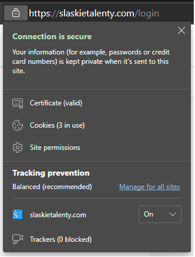

## Wykorzystujemy SSL

Nasza aplikacja wykorzystuje protokół SSL na każdej stronie i podstronach. Dzięki temu dane przekazywane do serwerów oraz te, które z serwera lądują w Twojej aplikacji są szyfrowane i bezpeczne.

Wystarczy spojrzeć na tą informację dostępną w pasku nawigacji każdej przeglądarki:

---

## Co to jest SSL?

Skrót SSL pochodzi on od angielskich słów Secure Socket Layer. Samą nazwę, jak i technologię z nią związaną, opracowało znane zapewne Wam przedsiębiorstwo Netscape, w 1994 roku. Uniwersalność, wysoka skuteczność i stosunkowo prosta implementacja tego rozwiązania sprawiła, że obecnie jest to powszechnie przyjęty standard szyfrowania na stronach internetowych.

SSL to protokół umożliwiający szyfrowanie strumienia informacji, który biegnie między użytkownikiem strony internetowej a serwerem tej strony. Daje on gwarancję, że przesyłane dane są bezpieczne i poufne.

---

## Jak działa szyfrowanie SSL?
Za pomocą SSL można szyfrować różnego rodzaju połączenia (np. FTP czy pocztę elektroniczną), jednak najczęściej wykorzystuje się go do zabezpieczania protokołu HTTP. Dzięki szyfrowaniu SSL otrzymujemy protokół HTTPS (HyperText Transfer Protocol Secure) i pewność, że dane wymieniane z witryną nie trafią w niepowołane ręce.

Ogólna metoda działania SSL na stronie WWW opiera się na kluczach szyfrowania i certyfikacie uwierzytelniającym.

W dużym uproszczeniu działa to tak, że każda ze stron, czyli (np. użytkownik i serwer WWW) posiada dwa klucze szyfrujące – klucz publiczny i klucz prywatny. Kiedy użytkownik zwraca się do serwera witryny o udostępnienie jakichś danych, serwer prosi naszą przeglądarkę o jej klucz publiczny. Następnie z jego pomocą szyfruje informacje potrzebne użytkownikowi i przesyła z powrotem do przeglądarki. Ta za pomocą klucza prywatnego (nieudostępnianego nikomu) odszyfrowuje dane i przekazuje użytkownikowi.

W sytuacji, gdy to użytkownik wysyła informacje do serwera (np. za pomocą formularza) zasada działania jest podobna. Wtedy to jego przeglądarka prosi serwer o klucz publiczny i szyfruje dane, które potem są rozszyfrowywane przez klucz prywatny serwera.

By dodatkowo podnieść bezpieczeństwo wprowadzono certyfikat klucza publicznego, powszechnie znany jako certyfikat SSL. Jest on wydawany przez zewnętrznego, zaufanego dostawcę (instytucję certyfikującą), która potwierdza, że podany klucz serwera faktycznie należy do niego.

---

## Certyfikat SSL –  co daje?
Główną zaletą szyfrowania jest, oczywiście, bezpieczeństwo danych użytkowników. Już samo to powinno skłonić właścicieli witryn do wdrożenia SSL. Dla tych, dla których to jednak za mało, mamy kolejne argumenty:

---

## Wiarygodność i integralność danych
Szyfrowanie i korzystanie z zewnętrznych certyfikatów sprawia, że ryzyko przechwycenia danych zabezpieczonych przez SSL jest znikome. Dodatkowo to rozwiązanie eliminuje ryzyko naruszenia ich integralności (czyli wprowadzenia nieautoryzowanych zmian przez osoby nieupoważnione), przez co to doskonałe rozwiązanie dla podmiotów, które muszą dostosować swoje witryny do wymagań prawnych (m.in. RODO).