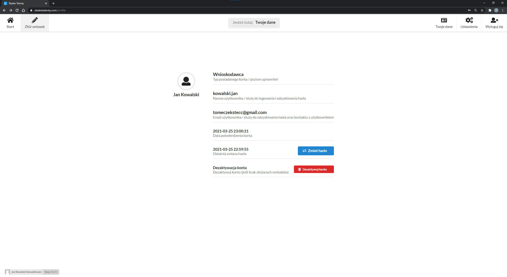

# Dostęp do własnych danych

Strona zapwenia dostęp do danych jakie gromadzimy o właścicielu konta, a także najważniejsze wydarzenia związane z obsługą profilu, jak data ostatniej zmiany hasła, data potwierdzenia konta.

---

# Zmiana hasła i dezaktywacja konta

Na tej stronie użytkowanik ma także dostęp do 0dodtkowych fujnkcji:
- zmainy hasła na żądanie
- dezaktywacji konta

Konto nie jest całkokicie usuwane z bazy danych ze względu na zgromadzone dane w logach.

