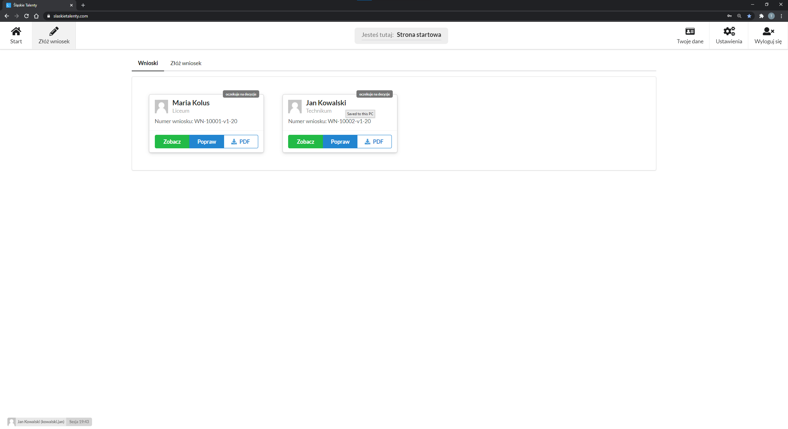

# Szybki podgląd

Jeśli użytkownik złożył już przynajmniej jeden wniosek na stronie startowej dostępny podgląd wniosku lub ich listę, w tym:
- imię i nazwisko uczennicy/ucznia,
- rodzaj szkoły,
- numer wniosku,
- stan wniosku

---

