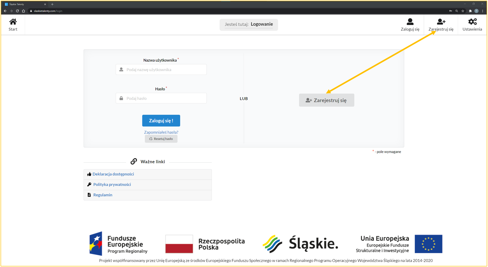
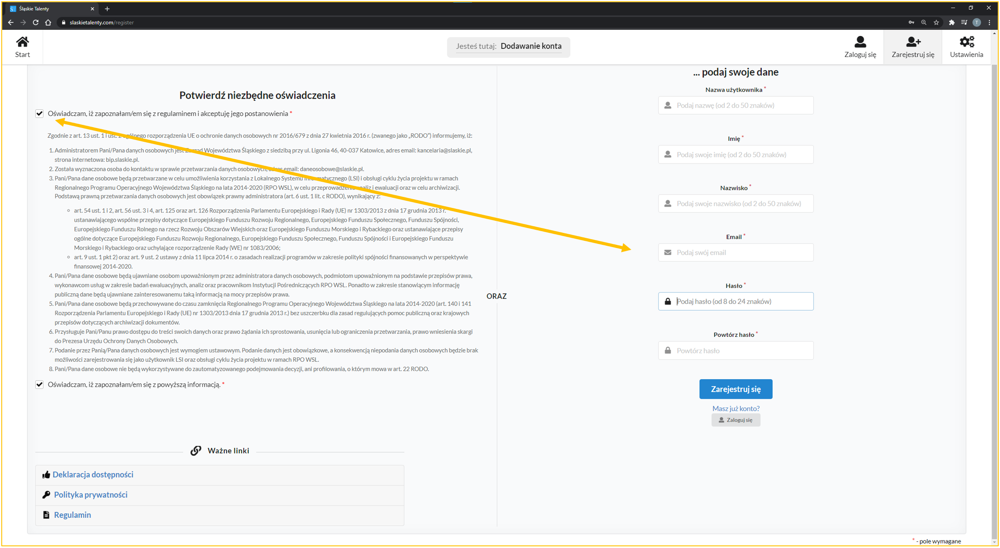
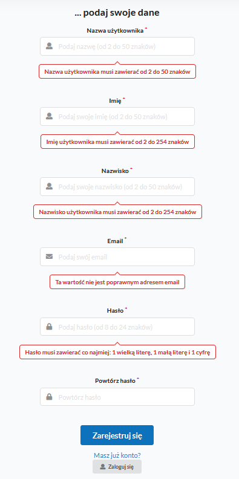

# "Nihil novi ..."

Stara śpiewka :sleeping: ... nic czego nie znasz :smile:...

Żeby rozpocząć pracę w systemie, pod adresem [Aplikacji](https://www.slaskietalenty.com) wybieramy odpowiedni przycisk, który prezekieruje nas do  strony rejestracji. Mamy do wyboru 2 miejsca:
wybierz jedną z ikon "Zarejestruj się":

---

# Formularz rejestracyjny
Zostaniesz przekierowana/y do strony rejestracji, gdzie należy zapoznanć się z treścią oświadczeń, zaznaczyć je i wypełnić wszystkie pola:

---

## Poprawność danych

Wszystkie wprowadzone informacje po nacinięciu przycisku "Zarejestruj się" zzostaną zweryfikowane (inaczej "[zwalidowane]()") pod względem oczekiwanej wartości lub struktury. Dzięki temu mamy pewność, że dane zapisane w bazie będą dpowiednie.

Lista walidacji "na wejściu" (walidacje odnoszące się do własnej zawartości):

Lista walidacji "na wyjściu" (walidacje związane z innymi danymi, tu - w bazie danych):

