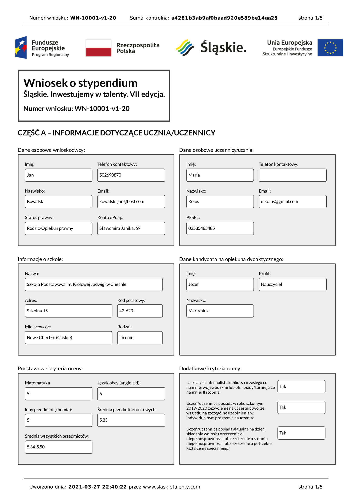

# Plik pdf

Ostatecznie produktem modułu skierowanego do Wnioskodawców jest wniosek w formacie pdf. Będzie to w zależności od przyjętego modelu jedyna bądź zasadnicza część wniosku przekazywana przez ePUAP.

Pdf tworzony jest w  momencie zapisu nowego wniosku lub zapisu w trakcie edycji wniosku istniejącego.

Plik pdf można pobrać z karty wniosku na stronie z listą wniosków (strona startowa):

---

## Plik pdf zawiera sekcje zgodne z zakładkami wniosku:

- strona 1

- strona 2

- strona 3

- strona 4

- strona 5
