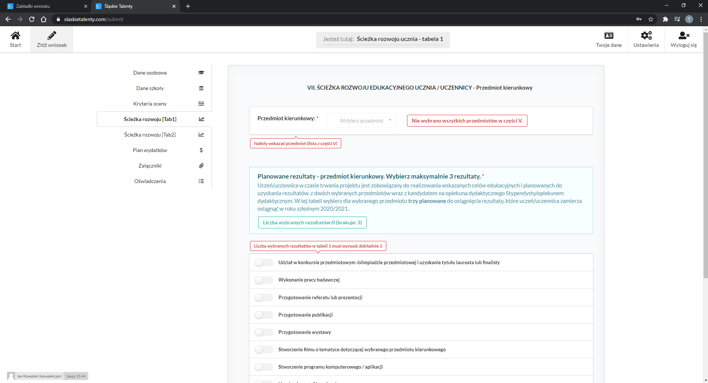
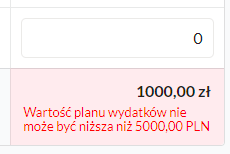

# Wniosek

Wniosek o stypendium to najważniejszy element aplikacji. Na podstawie wprowadzonych danych w tej części wygenerujemy pdf, który przekazany zostanie przez ePUAP. Wnioskodawca wprowadza dane kolejnych zakładkac.

---

## Zakładka: Informacje dotyczące ucznia/uczennicy

W tej zakładce użytkownik poda podstawowe dane osobowe i kontaktowe Wnioskodawcy oraz uczennicy lub ucznia. Nie wszystkie pola są obowiązkowe.


Pola `Imię wnioskodawcy`, `Nazwisko wnioskodawcy` oraz `Email wnioskodawcy` wypełniane są automatycznie na podstawie danych dostarczonych przy rejestracji i nie mogą zostać zmienione:


Pola `Imię ucznia`, `Nazwisko ucznia` oraz `Email ucznia` wypełniane są automatycznie jeżel w polu `Status wnioskodawcy` użytkownik wybierze opcję `Pełnoletni uczeń`.

### Walidacje

Walidowane są wszystkie pola na podstawie wprowadzonej wartości. Walidacje odnoszą się do długości tekstu, formatu danych, unikalności danych w całej bazie danych (PESEL):


---

## Zakładka: Informacje dotyczące szkoły i opiekuna

W tej zakładce użytkownik poda podstawowe dane szkoły i kandydata na opiekuna dydaktycznego.


### Walidacje

Walidowane są wszystkie pola na podstawie wprowadzonej wartości. Walidacje odnoszą się do długości tekstu, formatu danych (np. kod pocztowy)


---

## Zakładka: Kryteria oceny

W tej zakładce użytkownik wybierze odpowiedzi dla zadanych kryteriów podstawowych i dodatkowych.


### Walidacje

Walidowane są wszystkie pola na podstawie wprowadzonej wartości. Walidacje odnoszą się do długości tekstu oraz zależą od wartości wybranych w zakładce `Załączniki`


Jeżeli wśród dodanych przez użytkownika załączników znajdzie się **_Potwierdzenie uzyskania tytułu finalisty lub laureata_** lub **_Zgoda na indywidualny to nauki_** lub **_Orzeczenie o stopniu niepełnosprawności_** aplikacja wymagać będzie dostosowania wyboru w tych polach:


---

## Zakładka: Ścieżka rozwoju - tabela 1

W tej zakładce użytkownik poda zaplanowane rezultaty do osiągniecia w zakresie przedmiotu kierunkowego, który także zostanie wybrany w tej zakładce.


Lista w polu `Przedmiot kierunkowy` generowana jest na podstawie wybranych przedmiotów w poprzedniej zakładce.

### Walidacje

Walidowane są wszystkie pola na podstawie wprowadzonej wartości. Walidacje odnoszą się do długości tekstu oraz zależą od wartości wybranych w zakładce `Kryteria oceny`



Aplikacja podpowiada na bieżąco liczbę rezultatów, które użytkownik powinien jeszcze wybrać.


---

## Zakładka: Ścieżka rozwoju - tabela 2

W tej zakładce użytkownik poda zaplanowane rezultaty do osiągniecia w zakresie przedmiotu kluczowego, który także zostanie wybrany w tej zakładce.


### Walidacje

Walidowane są wszystkie pola na podstawie wprowadzonej wartości. Walidacje odnoszą się do długości tekstu oraz zależą od wartości wybranych w zakładce `Kryteria oceny`


Aplikacja podpowiada na bieżąco liczbę rezultatów, które użytkownik powinien jeszcze wybrać.


---

## Zakładka: Plan wydatków

W tej zakładce użytkownik zaplanuje koszty zgodnie z podziałem ujętym w tabeli.


### Walidacje

Walidowane są wszystkie pola na podstawie wprowadzonej wartości. Wartości liczbowo we są kontrolowane (max: 999 999, tylko cyfry). Walidacje odnoszą się do długości tekstu (część A i B)

Uzasadnienie w części A można wypełnić jedynie, gry użytkownik poda liczbę w wierszu12.


Aplikacja podpowiada osiągniecie minimum na bieżąco.



---

## Zakładka: Załączniki do wniosku (dla wersji o obsługą załączników)

W tej zakładce użytkownik doda odpowiednie załączniki:

- obowiązkowe: **_oświadczenie opiekuna dydaktycznego_**, **_Świadectwo szkolne za ostatni rok_**
- opcjonalne (1 sztuka dla rodzaju): **_Zgoda na indywidualny tryb nauki_**, **_Orzeczenie o niepełnosprawności_**
- opcjonalne (dopuszcza się wiele): **_Zaświadczenie o uzyskanych tytułach_**


### Walidacje

Sprawdzane są następujące właściwości:
- wielkość pliku: obecnie 20MB do ustalenia
- rodzaj pliku: dopuszcza się formaty: .pdf, .jpg, .png
- powiązanie z odpowiedziami udzielonym i w zakładce ```Kryteria oceny``` (aplikacja wymusi dodanie załącznika odpowiedniego rodzaju, jeżeli w tej zakładce wybrano odpowiedź ***TAK***)


Aplikacja będzie także informować o rodzaju błędu przy poróbie dodania pliku, jeżeli błąd wystąpi:


- rodzaj pliku


- wielkość pliku


---

## Zakładka: Oświadczenia

W tej zakładce użytkownik zapozna się z treścią oświadczeń, co potwierdzi zaznaczając odpowiedni checkbox:


### Walidacje

Sprawdzane będzie zaznaczenie pola:


